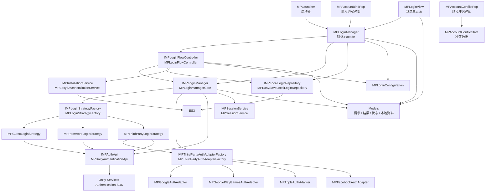
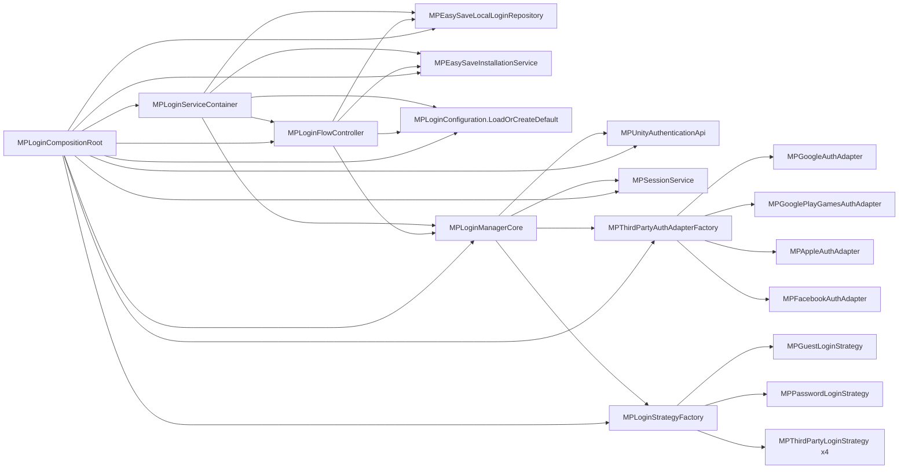
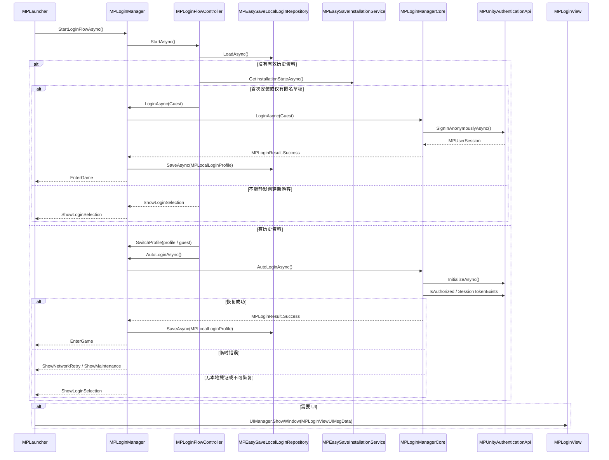
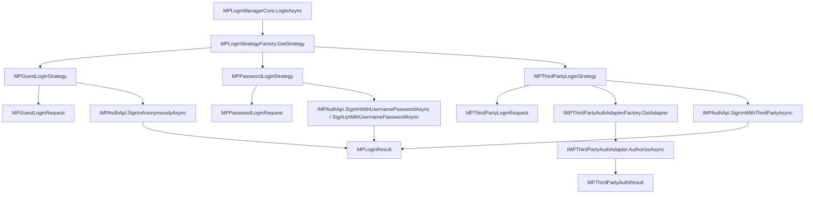
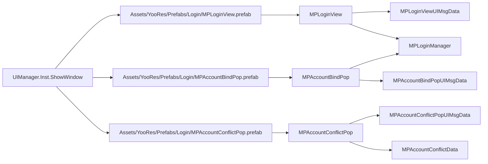

# 登录模块关系图与类说明

本文档基于当前 `Assets/Scripts/Login` 下的最新代码整理，用于快速理解登录模块的分层、类之间的依赖方向、启动流程和每个类型的职责。

## 模块目标

- 使用 Unity Authentication 作为当前认证后端。
- 默认支持游客/匿名登录，并预留账号密码、Google、Google Play Games、Apple、Facebook 登录能力。
- UI、启动决策、登录编排、具体 SDK 调用、本地资料持久化彼此解耦。
- 通过接口抽象隔离 Unity SDK、ES3、第三方平台 SDK，后续接入游戏服务器或云存档时尽量不改 UI 层。

## 当前关键约定

- 游客 Unity Authentication Profile 固定为 `guest`。
- Unity Services Environment：编辑器使用 `development`，发布构建使用 `production`。
- `MPLoginConfiguration.EnableAnonymousRecovery` 当前默认关闭，因为项目尚未接入真正的服务端游客恢复接口。
- 本地只保存恢复线索和偏好，不保存 AccessToken 或 SessionToken 明文。
- UI 页面使用项目当前 UIManager 框架，通过 `[Component("PrefabName")]` + `[TransformPath("...")]` 绑定 Prefab。

## 分层关系总图

## 依赖装配图

`MPLoginCompositionRoot` 是默认依赖装配点。它集中创建接口实现，避免 UI 或业务代码里到处 `new` 登录模块内部类。

## 启动登录流程

## 登录方式策略图

## UI 与 Prefab 关系

## 类与接口说明

### 对外入口

| 类型 | 文件 | 作用 | 关联关系 |
| --- | --- | --- | --- |
| `MPLoginManager` | `MPLoginManager.cs` | 登录模块对外 Facade。UI、启动器、业务代码应优先通过它调用登录、启动恢复、绑定、登出、刷新状态等能力。 | 持有 `IMPLoginManager`、`IMPLoginFlowController`、`IMPLocalLoginRepository`、`MPLoginConfiguration`；由 `MPLoginCompositionRoot` 创建依赖；被 `MPLoginView`、`MPAccountBindPop`、`MPLauncher` 调用。 |

### 接口抽象层

| 类型 | 文件 | 作用 | 关联关系 |
| --- | --- | --- | --- |
| `IMPAuthApi` | `Abstractions/IMPAuthApi.cs` | 认证后端抽象，隔离 Unity Authentication SDK。 | 实现类是 `MPUnityAuthenticationApi`；被 Strategy 和 `MPLoginManagerCore` 调用。 |
| `IMPLoginManager` | `Abstractions/IMPLoginManager.cs` | 核心登录能力抽象，定义登录、自动恢复、绑定、刷新、登出和状态事件。 | 实现类是 `MPLoginManagerCore`；被 `MPLoginManager` 和 `MPLoginFlowController` 依赖。 |
| `IMPLoginFlowController` | `Abstractions/IMPLoginFlowController.cs` | 启动登录决策抽象，返回 UI/场景下一步动作。 | 实现类是 `MPLoginFlowController`；被 `MPLoginManager` 调用。 |
| `IMPLoginStrategy` | `Abstractions/IMPLoginStrategy.cs` | 单一登录方式策略接口。 | `MPGuestLoginStrategy`、`MPPasswordLoginStrategy`、`MPThirdPartyLoginStrategy` 实现；由 `MPLoginStrategyFactory` 管理。 |
| `IMPLoginStrategyFactory` | `Abstractions/IMPLoginStrategyFactory.cs` | 根据 `MPLoginType` 返回对应登录策略。 | 实现类是 `MPLoginStrategyFactory`；被 `MPLoginManagerCore` 调用。 |
| `IMPThirdPartyAuthAdapter` | `Abstractions/IMPThirdPartyAuthAdapter.cs` | 第三方平台授权适配器接口。 | `MPProvidedTokenAuthAdapterBase` 实现基础逻辑；Google/Apple/Facebook 适配器继承它。 |
| `IMPThirdPartyAuthAdapterFactory` | `Abstractions/IMPThirdPartyAuthAdapterFactory.cs` | 根据第三方登录类型返回对应 Adapter。 | 实现类是 `MPThirdPartyAuthAdapterFactory`；被 `MPThirdPartyLoginStrategy` 和 `MPLoginManagerCore.LinkAsync` 调用。 |
| `IMPLocalLoginRepository` | `Abstractions/IMPLocalLoginRepository.cs` | 本地登录资料仓储接口。 | 实现类是 `MPEasySaveLocalLoginRepository`；被 `MPLoginManager` 和 `MPLoginFlowController` 依赖。 |
| `IMPInstallationService` | `Abstractions/IMPInstallationService.cs` | 安装状态判断接口。 | 实现类是 `MPEasySaveInstallationService`；被 `MPLoginFlowController` 依赖。 |
| `IMPSessionService` | `Abstractions/IMPSessionService.cs` | 当前内存 Session 存取接口。 | 实现类是 `MPSessionService`；被 `MPLoginManagerCore` 依赖。 |

### 核心编排层

| 类型 | 文件 | 作用 | 关联关系 |
| --- | --- | --- | --- |
| `MPLoginCompositionRoot` | `Core/MPLoginCompositionRoot.cs` | 默认依赖装配入口，集中创建 AuthApi、Strategy、Adapter、Repository、Flow、Core。 | 返回 `MPLoginServiceContainer`；被 `MPLoginManager` 构造函数调用。 |
| `MPLoginServiceContainer` | `Core/MPLoginServiceContainer.cs` | 登录模块默认依赖集合。 | 保存 `loginManager`、`flowController`、`localLoginRepository`、`installationService`、`configuration`。 |
| `MPLoginManagerCore` | `Core/MPLoginManagerCore.cs` | 核心登录编排器，负责状态管理、事件派发、策略选择、Session 更新、登录/绑定/刷新/登出。 | 依赖 `IMPLoginStrategyFactory`、`IMPThirdPartyAuthAdapterFactory`、`IMPAuthApi`、`IMPSessionService`；返回 `MPLoginResult`。 |
| `MPLoginFlowController` | `Core/MPLoginFlowController.cs` | 启动流程决策器，根据本地资料、安装状态、配置和登录结果决定 `EnterGame`、`ShowLoginSelection`、`ShowNetworkRetry` 等动作。 | 依赖 `IMPLoginManager`、`IMPLocalLoginRepository`、`IMPInstallationService`、`MPLoginConfiguration`；产出 `MPLoginStartupResult`。 |
| `MPLoginStrategyFactory` | `Core/MPLoginStrategyFactory.cs` | 登录策略注册表。 | 保存 `MPLoginType -> IMPLoginStrategy` 映射；被 `MPLoginManagerCore` 查询。 |
| `MPThirdPartyAuthAdapterFactory` | `Core/MPThirdPartyAuthAdapterFactory.cs` | 第三方授权适配器注册表。 | 保存 `MPLoginType -> IMPThirdPartyAuthAdapter` 映射；被第三方策略和绑定流程查询。 |
| `MPSessionService` | `Core/MPSessionService.cs` | 内存 Session 容器，不负责持久化 Token。 | 被 `MPLoginManagerCore` 设置、读取和清理。 |
| `MPLoginExceptionMapper` | `Core/MPLoginExceptionMapper.cs` | 把 Unity Services 或系统异常转换为项目统一错误结构。 | 被 Strategy 和 Core 捕获异常时调用，返回 `MPLoginError`。 |

### 认证 API 层

| 类型 | 文件 | 作用 | 关联关系 |
| --- | --- | --- | --- |
| `MPUnityAuthenticationApi` | `Api/MPUnityAuthenticationApi.cs` | Unity Authentication SDK 封装，实现初始化、匿名登录、账号密码登录/注册、第三方登录/绑定、Profile 切换、登出、Session 转换。 | 实现 `IMPAuthApi`；被策略和 `MPLoginManagerCore` 调用；直接依赖 `Unity.Services.Authentication` 和 `Unity.Services.Core`。 |

### 登录策略层

| 类型 | 文件 | 作用 | 关联关系 |
| --- | --- | --- | --- |
| `MPGuestLoginStrategy` | `Strategies/MPGuestLoginStrategy.cs` | 游客/匿名登录策略，校验请求类型并调用 `IMPAuthApi.SignInAnonymouslyAsync`。 | 实现 `IMPLoginStrategy`；被 `MPLoginStrategyFactory` 注册。 |
| `MPPasswordLoginStrategy` | `Strategies/MPPasswordLoginStrategy.cs` | Unity Authentication 账号密码登录/注册策略。 | 实现 `IMPLoginStrategy`；使用 `MPPasswordLoginRequest`；调用 `IMPAuthApi.SignInWithUsernamePasswordAsync` 或 `SignUpWithUsernamePasswordAsync`。 |
| `MPThirdPartyLoginStrategy` | `Strategies/MPThirdPartyLoginStrategy.cs` | 第三方登录策略，负责从 Adapter 获取统一授权结果，再交给 Unity Authentication 登录。 | 实现 `IMPLoginStrategy`；依赖 `IMPThirdPartyAuthAdapterFactory` 和 `IMPAuthApi`；处理 Google/GPGS/Apple/Facebook 四种类型。 |

### 第三方适配器层

| 类型 | 文件 | 作用 | 关联关系 |
| --- | --- | --- | --- |
| `MPProvidedTokenAuthAdapterBase` | `Adapters/MPProvidedTokenAuthAdapterBase.cs` | 第三方 Adapter 基类。当前阶段不主动拉起 SDK，只校验外部传入的 token/authCode。 | 实现 `IMPThirdPartyAuthAdapter`；被具体平台 Adapter 继承。 |
| `MPGoogleAuthAdapter` | `Adapters/MPGoogleAuthAdapter.cs` | Google 登录适配器，要求 `identityToken`。 | 继承 `MPProvidedTokenAuthAdapterBase`；返回 `MPThirdPartyAuthResult` 给第三方策略。 |
| `MPGooglePlayGamesAuthAdapter` | `Adapters/MPGooglePlayGamesAuthAdapter.cs` | Google Play Games 登录适配器，要求 `authorizationCode`。 | 继承 `MPProvidedTokenAuthAdapterBase`；返回 `MPThirdPartyAuthResult`。 |
| `MPAppleAuthAdapter` | `Adapters/MPAppleAuthAdapter.cs` | Apple 登录适配器，要求 `identityToken`，可透传 `authorizationCode`。 | 继承 `MPProvidedTokenAuthAdapterBase`；返回 `MPThirdPartyAuthResult`。 |
| `MPFacebookAuthAdapter` | `Adapters/MPFacebookAuthAdapter.cs` | Facebook 登录适配器，要求 `accessToken`。 | 继承 `MPProvidedTokenAuthAdapterBase`；返回 `MPThirdPartyAuthResult`。 |

### 持久化与配置层

| 类型 | 文件 | 作用 | 关联关系 |
| --- | --- | --- | --- |
| `MPEasySaveLocalLoginRepository` | `Persistence/MPEasySaveLocalLoginRepository.cs` | 基于 ES3 保存/读取本地登录资料 JSON、安装 Id、匿名 Id、历史 PlayerId、最近登录方式。 | 实现 `IMPLocalLoginRepository`；读写 `MPLocalLoginProfile`；被 Facade 和 Flow 使用。 |
| `MPEasySaveInstallationService` | `Persistence/MPEasySaveInstallationService.cs` | 基于 ES3 判断当前是否存在历史启动/登录线索。 | 实现 `IMPInstallationService`；被 `MPLoginFlowController` 用于首次安装判断。 |
| `MPLoginConfiguration` | `Config/MPLoginConfiguration.cs` | 登录模块配置资产，可通过 Resources 下 `MPLoginConfiguration` 覆盖默认配置。 | 被 `MPLoginFlowController` 和 UI 读取；控制匿名登录、账号密码、第三方入口、自动恢复、绑定提示等开关。 |

### UI 层

| 类型 | 文件 | 作用 | 关联关系 |
| --- | --- | --- | --- |
| `MPLoginView` | `UI/MPLoginView.cs` | 登录主页面，展示启动结果、登录方式入口、账号密码输入、重试和游客继续按钮。 | 继承 `AWindow`；绑定 `MPLoginView.prefab`；调用 `MPLoginManager`；接收 `MPLoginViewUIMsgData`。 |
| `MPLoginViewUIMsgData` | `UI/MPLoginView.cs` | 登录主页面打开参数。 | 携带 `MPLoginStartupResult` 和登录成功回调；由启动器传给 `MPLoginView`。 |
| `MPAccountBindPop` | `UI/MPAccountBindPop.cs` | 游客绑定提示弹窗，支持账号密码绑定入口，第三方绑定入口预留。 | 继承 `AWindow`；绑定 `MPAccountBindPop.prefab`；调用 `MPLoginManager.LinkAsync`；接收 `MPAccountBindPopUIMsgData`。 |
| `MPAccountBindPopUIMsgData` | `UI/MPAccountBindPop.cs` | 绑定弹窗打开参数。 | 携带标题、说明、关闭回调、绑定成功回调。 |
| `MPAccountConflictPop` | `UI/MPAccountConflictPop.cs` | 账号冲突确认弹窗。当前为后续第三方账号冲突处理预留。 | 继承 `AWindow`；绑定 `MPAccountConflictPop.prefab`；接收 `MPAccountConflictPopUIMsgData`。 |
| `MPAccountConflictPopUIMsgData` | `UI/MPAccountConflictPop.cs` | 冲突弹窗打开参数。 | 携带 `MPAccountConflictData`、取消回调、确认回调。 |

### 数据模型层

| 类型 | 文件 | 作用 | 关联关系 |
| --- | --- | --- | --- |
| `MPUserSession` | `Models/MPUserSession.cs` | 登录成功后的内存会话，包含 PlayerId、PlayerName、Username、AccessToken、SessionToken、Profile、登录方式等。 | 由 `MPUnityAuthenticationApi` 创建；由 `MPSessionService` 保存；被 `MPLoginResult` 包装。 |
| `MPLoginResult` | `Models/MPLoginResult.cs` | 登录、注册、绑定等操作的统一结果。 | 包装 `MPUserSession` 或 `MPLoginError`；由 Strategy/Core/Facade 返回给 UI。 |
| `MPLoginStartupResult` | `Models/MPLoginStartupResult.cs` | 启动登录流程结果，告诉 UI/场景下一步动作。 | 由 `MPLoginFlowController` 创建；被 `MPLoginView` 展示；包含 `MPLoginStartupAction`。 |
| `MPLoginRequest` | `Models/MPLoginRequest.cs` | 登录请求基类。 | `MPGuestLoginRequest`、`MPPasswordLoginRequest`、`MPThirdPartyLoginRequest` 继承它。 |
| `MPGuestLoginRequest` | `Models/MPLoginRequest.cs` | 游客登录请求，包含匿名 Id、安装 Id、幂等键、设备信息预留字段。 | 被 `MPGuestLoginStrategy` 使用；由 `MPLoginFlowController` 创建。 |
| `MPPasswordLoginRequest` | `Models/MPLoginRequest.cs` | 账号密码登录、注册、绑定、改密请求。 | 被 `MPPasswordLoginStrategy` 和 `MPLoginManagerCore.LinkAsync` 使用。 |
| `MPThirdPartyLoginRequest` | `Models/MPLoginRequest.cs` | 第三方登录/绑定请求，包含 authCode、accessToken、identityToken、platformUserId、createAccount、forceLink。 | 被 `MPThirdPartyLoginStrategy` 和 Adapter 使用。 |
| `MPLoginError` | `Models/MPLoginError.cs` | 登录模块统一错误结构。 | 由 `MPLoginExceptionMapper` 或策略创建；被 `MPLoginResult`、`MPLoginStartupResult` 携带。 |
| `MPLoginErrorCodes` | `Models/MPLoginErrorCodes.cs` | 登录模块错误码常量集合。 | 被错误创建、策略校验、流程分支判断使用。 |
| `MPThirdPartyAuthResult` | `Models/MPThirdPartyAuthResult.cs` | 第三方平台授权统一结果。 | 由 Adapter 返回；被 `MPThirdPartyLoginStrategy` 传给 `IMPAuthApi.SignInWithThirdPartyAsync`。 |
| `MPLocalLoginProfile` | `Models/MPLocalLoginProfile.cs` | 本地登录资料快照，保存恢复线索、Profile、匿名 Id、安装 Id、绑定标记和最近登录方式。 | 由 `MPEasySaveLocalLoginRepository` 持久化；被 Flow 决策和 Facade 保存登录结果时使用。 |
| `MPLoginPreference` | `Models/MPLoginPreference.cs` | 登录页展示偏好，用于后续根据本地资料调整 UI 排序或提示。 | 从 `MPLocalLoginProfile` 生成。 |
| `MPLoginUserInfo` | `Models/MPLoginUserInfo.cs` | 给旧 UI 或业务使用的轻量用户信息。 | 从 `MPUserSession` 转换；由 `MPLoginManager.UserInfo` 暴露。 |
| `MPAccountConflictData` | `Models/MPAccountConflictData.cs` | 第三方账号绑定冲突数据。 | 被 `MPAccountConflictPop` 展示和回调传递。 |
| `MPAccountSummary` | `Models/MPAccountSummary.cs` | 冲突页面展示用账号摘要。 | 被 `MPAccountConflictData.currentAccount/existingAccount` 引用。 |

### 枚举说明

| 类型 | 文件 | 作用 | 关联关系 |
| --- | --- | --- | --- |
| `MPLoginType` | `Models/MPLoginType.cs` | 登录方式枚举：Guest、UsernamePassword、Google、GooglePlayGames、Apple、Facebook。 | Strategy、Adapter、Request、Result、Session 都会使用。 |
| `MPLoginProvider` | `Models/MPLoginProvider.cs` | 本地偏好中的登录提供方，更偏 UI 排序和历史记录。 | `MPLocalLoginProfile`、`MPLoginPreference`、`MPLoginStartupResult` 使用。 |
| `MPLoginState` | `Models/MPLoginState.cs` | 登录状态枚举，供 Core、Flow、UI 监听和展示。 | `MPLoginManagerCore`、`MPLoginFlowController`、`MPLoginManager` 事件使用。 |
| `MPLoginStartupAction` | `Models/MPLoginStartupAction.cs` | 启动流程建议动作：EnterGame、ShowLoginSelection、ShowNetworkRetry 等。 | `MPLoginStartupResult` 使用；`MPLoginView` 根据它刷新 UI。 |
| `MPPasswordLoginMode` | `Models/MPLoginRequest.cs` | 账号密码请求模式：Login、Register、AddToCurrentUser、UpdatePassword。 | `MPPasswordLoginRequest` 使用；策略和绑定流程分支判断。 |
| `MPAccountType` | `Models/MPAccountType.cs` | 游戏账号状态：Unknown、Anonymous、Bound、Temporary。 | `MPLocalLoginProfile` 和 Flow 恢复决策使用。 |
| `MPInstallationState` | `Models/MPInstallationState.cs` | 安装状态：FirstInstall、ExistingInstall、Unknown。 | `MPEasySaveInstallationService` 返回；`MPLoginFlowController` 决定是否自动创建游客。 |

## 主要业务链路

### 首次启动游客登录

1. `MPLoginManager.StartLoginFlowAsync` 调用 `MPLoginFlowController.StartAsync`。
2. Flow 通过 `IMPLocalLoginRepository.LoadAsync` 读取本地资料。
3. 没有有效历史时，通过 `IMPInstallationService.GetInstallationStateAsync` 判断是否首次安装。
4. 若允许首次自动游客登录，则创建 `MPGuestLoginRequest` 并调用 `MPLoginManager.LoginAsync(MPLoginType.Guest, request)`。
5. Facade 转给 `MPLoginManagerCore.LoginAsync`。
6. Core 通过 `MPLoginStrategyFactory` 找到 `MPGuestLoginStrategy`。
7. Guest Strategy 调用 `MPUnityAuthenticationApi.SignInAnonymouslyAsync`。
8. AuthApi 使用 `guest` Profile 登录 Unity Authentication，并返回 `MPUserSession`。
9. Core 更新 `MPSessionService`，Facade/Flow 保存 `MPLocalLoginProfile`。
10. Flow 返回 `MPLoginStartupResult.EnterGame`。

### 启动自动恢复

1. Flow 读取到有效本地资料后，先根据 `MPLocalLoginProfile.unityProfile` 或匿名历史切回 `guest` Profile。
2. 调用 `MPLoginManager.AutoLoginAsync`。
3. Facade 再次执行 Profile 准备，防止外部绕过 Flow 直接调用自动登录。
4. Core 初始化 Unity Services，并检查当前 `IsAuthorized` 或 `SessionTokenExists`。
5. 恢复成功则同步 `MPUserSession` 并进入游戏。
6. `NO_LOCAL_SESSION` 不再进入 `ShowAnonymousRecovery`，因为当前没有服务端匿名恢复接口。

### 账号密码登录/注册

1. `MPLoginView` 收集账号和密码。
2. 创建 `MPPasswordLoginRequest`，调用 `MPLoginManager.LoginAsync(MPLoginType.UsernamePassword, request)`。
3. Core 选择 `MPPasswordLoginStrategy`。
4. Strategy 按 `MPPasswordLoginMode.Login/Register` 调用 AuthApi。
5. AuthApi 调用 Unity Authentication 账号密码登录或注册 API。
6. 成功后返回 `MPLoginResult.Success`，本地资料标记为正式绑定账号。

### 第三方登录

1. 外部平台 SDK 获取 token/authCode 后创建 `MPThirdPartyLoginRequest`。
2. 调用 `MPLoginManager.LoginAsync(provider, request)` 或 `LoginWithProviderAsync`。
3. Core 选择对应 `MPThirdPartyLoginStrategy`。
4. Strategy 通过 `MPThirdPartyAuthAdapterFactory` 获取对应 Adapter。
5. Adapter 校验并转换 token/authCode 为 `MPThirdPartyAuthResult`。
6. Strategy 调用 AuthApi 的 Unity Authentication 第三方登录接口。
7. 成功后保存 Session 和本地资料。

### 账号绑定

1. `MPAccountBindPop` 通过账号密码绑定时调用 `MPLoginManager.LinkAsync(MPLoginType.UsernamePassword, request)`。
2. 第三方绑定入口当前预留，后续拿到 token 后调用 `MPLoginManager.BindProviderAsync` 或 `LinkGoogleAsync` 等快捷方法。
3. Core 的 `LinkAsync` 分账号密码和第三方两条路径。
4. 账号密码绑定调用 `IMPAuthApi.LinkUsernamePasswordAsync`。
5. 第三方绑定先通过 Adapter 获取授权结果，再调用 `IMPAuthApi.LinkThirdPartyAsync`。
6. 成功后更新 `MPLocalLoginProfile` 的绑定标记。

## 后续扩展点

| 扩展目标 | 推荐修改位置 | 原因 |
| --- | --- | --- |
| 接入真实 Google SDK 获取 Identity Token | 新增或替换 `MPGoogleAuthAdapter` | 不影响 Core、Flow、UI 的登录编排。 |
| 接入 Google Play Games Auth Code | 新增或替换 `MPGooglePlayGamesAuthAdapter` | 保持第三方策略统一。 |
| 接入 Apple SDK | 新增或替换 `MPAppleAuthAdapter` | 只改平台授权逻辑。 |
| 接入 Facebook SDK | 新增或替换 `MPFacebookAuthAdapter` | 只改平台授权逻辑。 |
| 接入游戏服务器账号恢复 | 新增服务器 API 抽象，并扩展 `MPLoginFlowController` | 匿名恢复和云存档归启动/恢复策略负责。 |
| 接入云存档 | 登录成功后读取 `MPLoginResult.playerId` / `MPUserSession.userId` | 云存档应绑定稳定 PlayerId。 |
| 调整登录页表现 | 修改 `MPLoginView` 和对应 Prefab | UI 只关心展示和按钮事件。 |
| 增加新的登录方式 | 新增 `MPLoginType`、Strategy、Adapter、AuthApi 方法，并在 `MPLoginCompositionRoot` 注册 | 与现有扩展结构一致。 |

## 阅读代码建议

1. 先看 `MPLoginManager`，理解外部能调用哪些能力。
2. 再看 `MPLoginFlowController`，理解启动时为什么进入游戏、登录页或重试页。
3. 再看 `MPLoginManagerCore`，理解登录、绑定、刷新、登出如何统一编排。
4. 看三类 Strategy，理解不同登录方式怎么分发。
5. 看 `MPUnityAuthenticationApi`，理解最终对 Unity Authentication 的调用。
6. 最后看 `MPLocalLoginProfile` 和 `MPEasySaveLocalLoginRepository`，理解本地恢复线索保存了什么。
